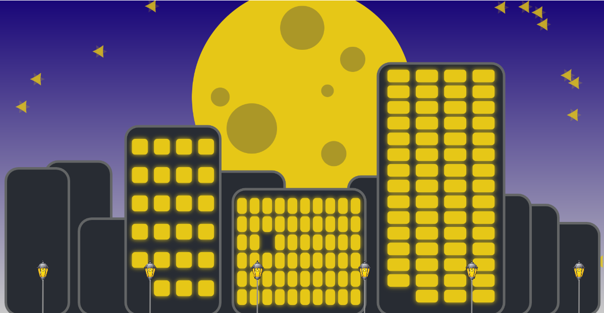
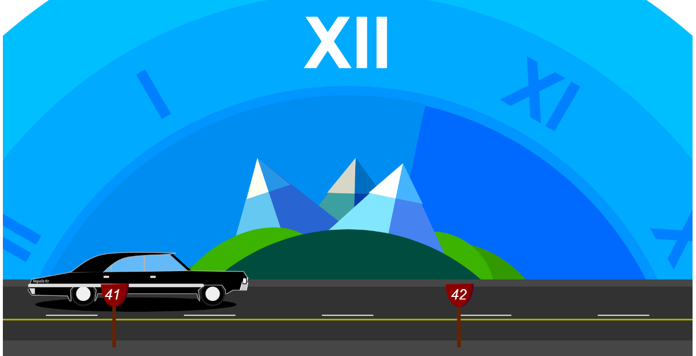

## MDDN 242 Project 1: Time-based Media  

### THIS IS YOUR README

Hello, I'm Long Nguyen
This is my Project 1 for Creative Coding 2
My clock name is Natural Time clock
My idea is that the clock will be a cycle of the sun, moon, clouds and stars
My intention was to make the sun/moon represent to the hours and the clouds/stars represent the minutes
There will be a sign to tell the time so it can be precisely 
My clock can tell time and can be an alarm 
when it is in the alarm mode, it is going to be a rain. Why rain? Well because normally when people use the alarm is to wake them up so I think that if it is raining it will be noisy and anoyyed so it will wake them up
Influences:

Design Journal
I started quite late because I missed the first week. That's why I have to hurried with my ideation. I always struggles with my idea because I always come up with a terrible idea or an idea that I don't have the ability to do it. When I made my first sketch, I realized that it was so bad and I quickly came up with a new sketch and idea. I started by making the basic components for my clock which are the ground, background color and the moon. Then I started to add movement to the moon according to the hour. Then I added if statement to change the moon to the sun when it is daytime and this apply to the ground's color as well. I made the background looked better by using gradient to add depth to the background. I added the stars to the scene but I was not able to figure out how to make it represent the minutes. I tried to added tree for daytime and coconut tree for nighttime but I failed because I missed place the code. Then I added clouds to the scene but I still not know how to make it exactly like what I intended. I added the sign to the scene so that it will indicate the time better. However, I still messed up when the sign grew so much bigger when it is day time because of the code I added earlier but with the help of my lecturer, I managed to realize and fix it. Later on, I managed to fixed the tree image problem and my scene has a tree for the day time and a coconut tree for the night time. At this time my only problem was the stars and clouds not able to appear every minutes. I was really stuck with this and cannot move on to do the alarm. I decided to skip the stars and clouds to finished the alarm. I was struggled to understand the alarm and I was not know how and where to put it into my code. I managed to add the alarm to my clock but everything just broke (my trees disappearred, my debug was not working, alarm was not working as well). I was really freak out because I cannot fix it unless I removed the alarm codes. Then with the help of my lecturer, I managed to fix that problem and I added rain to the scene when the alarm goes off. I cannot figure out how to make the stars and clouds automately appear so I decided to do it manually because I don't have much time. 

